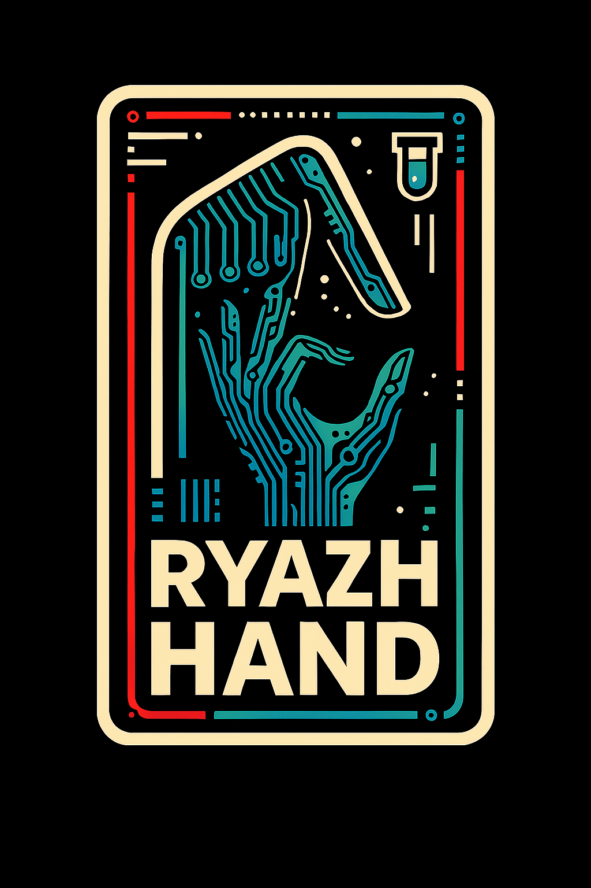

<div align="center">

# 🎮 Ryazhahand Overlay
### Мощный оверлей-менеджер для Nintendo Switch

[](LICENSE)
[](https://github.com/Dimasick-git/Ryazhahand-Overlay/releases)
[](#)
[](https://boosty.to/dimasick-git/donate)

[🚀 Установка](#-установка) • [✨ Возможности](#-возможности) • [📖 Использование](#-использование) • [🔄 Обновление](#-обновление) • [💬 Контакты](#-контакты)

</div>

---

## 📋 Описание

**Ryazhahand Overlay** — это форк популярного проекта Ultrahand, полностью переработанный и оптимизированный для стабильной работы на Nintendo Switch. Проект представляет собой мощный инструмент управления оверлеями с расширенным функционалом и современным дизайном.

### 🎯 Ключевые отличия от Ultrahand:

- ✅ **Стабильная сборка** — исправлены все критические баги
- 🔁 **Полная замена** `ULTRAHAND_*` → `RYAZHAHAND_*` во всем коде
- 🛠️ **Устранены конфликты** constexpr строк
- 📦 **Пересобран и подписан** `ovlmenu.ovl`
- 🔄 **Автообновление** прямо через консоль
- 🎨 **Новые темы** и улучшенный интерфейс
- 🌐 **Поддержка языков** включая русский

---

## ✨ Возможности

### 🔥 Основной функционал

- **📱 Меню оверлеев** — быстрый доступ ко всем установленным оверлеям
- **⚙️ Управление системой** — расширенные настройки консоли
- **🎮 Профили игр** — сохранение и загрузка конфигураций
- **🔧 Кастомные команды** — создание собственных скриптов
- **📊 Мониторинг** — отслеживание температуры, частот и загрузки
- **🎨 Темы оформления** — выбор из множества стилей
- **🌍 Мультиязычность** — поддержка русского и других языков

### 🛠️ Продвинутые фичи

- 🔄 Автоматическое обновление через консоль
- 📦 Система пакетов для установки модов
- 🎯 Горячие клавиши для быстрого доступа
- 💾 Резервное копирование настроек
- 🔍 Поиск по оверлеям
- 📝 Логирование действий

---

## 🚀 Установка

### Требования

- Nintendo Switch с установленным Atmosphère CFW
- Tesla Menu (nx-ovlloader)
- SD карта с достаточным свободным местом

### Автоматическая установка (рекомендуется)

1. Скачайте последний релиз из раздела [Releases](https://github.com/Dimasick-git/Ryazhahand-Overlay/releases)
2. Распакуйте архив в корень SD карты
3. Перезагрузите консоль
4. Откройте Tesla Menu (L + DPad Down + R3)
5. Выберите Ryazhahand Overlay

### Ручная установка

```bash
# Структура файлов на SD карте
sdmc:/
├── switch/
│   └── .overlays/
│       └── ovlmenu.ovl          # Основной файл
├── config/
│   └── ryazhahand/
│       ├── config.ini           # Конфигурация
│       ├── packages/            # Пакеты
│       └── lang/                # Языковые файлы
└── atmosphere/
    └── contents/
```

### Обновление с Ultrahand

Если у вас установлен Ultrahand:

1. Удалите старые файлы Ultrahand
2. Установите Ryazhahand Overlay
3. Ваши настройки будут автоматически конвертированы

---

## 📖 Использование

### Основные горячие клавиши

- **L + DPad Down + R3** — открыть Tesla Menu
- **A** — выбрать/подтвердить
- **B** — назад/отмена
- **X** — дополнительные опции
- **Y** — поиск
- **Plus** — настройки

### Первый запуск

1. Откройте Tesla Menu
2. Выберите Ryazhahand Overlay
3. Ознакомьтесь с приветственным меню
4. Настройте язык и тему
5. Начните использование!

### Создание пакетов

Пакеты позволяют быстро устанавливать моды и настройки:

```ini
[Package Info]
name=Мой пакет
author=Ваше имя
version=1.0.0
description=Описание пакета

[Files]
file1=/path/to/source -> /path/to/destination
file2=/another/source -> /another/destination

[Commands]
cmd1=mkdir /path/to/folder
cmd2=reboot
```

---

## 🔄 Обновление

### Через консоль (рекомендуется)

1. Откройте Ryazhahand Overlay
2. Перейдите в Settings
3. Выберите "Check for updates"
4. Подтвердите установку
5. Перезагрузите консоль

### Вручную

1. Скачайте новую версию
2. Замените файл `ovlmenu.ovl`
3. Перезагрузите консоль

---

## 💬 Контакты

### Поддержка проекта

Если вам нравится проект и вы хотите поддержать его развитие:

<div align="center">

[](https://boosty.to/dimasick-git/donate)

</div>

- 💰 **Boosty**: [Поддержать разработку](https://boosty.to/dimasick-git/donate)
- ⭐ **GitHub**: Поставьте звезду репозиторию!
- 🐛 **Issues**: [Сообщить о баге](https://github.com/Dimasick-git/Ryazhahand-Overlay/issues)
- 💡 **Discussions**: [Обсуждения](https://github.com/Dimasick-git/Ryazhahand-Overlay/discussions)

### Связь с разработчиком

- **GitHub**: [@Dimasick-git](https://github.com/Dimasick-git)
- **Issues**: Для багов и предложений

---

## 📄 Лицензии

Этот проект распространяется под двойной лицензией:

- **Код**: [GPL-2.0](LICENSE) — GNU General Public License v2.0
- **Документация и медиа**: [CC-BY-4.0](SUB_LICENSE) — Creative Commons Attribution 4.0

### Благодарности

- **Ultrahand** — оригинальный проект, послуживший основой
- **Tesla Menu** — система оверлеев для Switch
- **Atmosphère Team** — за потрясающий CFW
- **DevkitPro** — за инструменты разработки
- **Все контрибьюторы** — спасибо за вклад! ❤️

---

## ⚠️ Дисклеймер

Этот проект предназначен исключительно для образовательных целей. Разработчики не несут ответственности за любой ущерб, нанесенный вашему устройству. Используйте на свой риск.

**Nintendo Switch™** является товарным знаком Nintendo. Этот проект не связан с Nintendo.

---

<div align="center">

### 🌟 Если проект оказался полезным, поставьте звезду!

[](https://star-history.com/#Dimasick-git/Ryazhahand-Overlay&Date)

**Сделано с ❤️ для сообщества Nintendo Switch**

</div>
