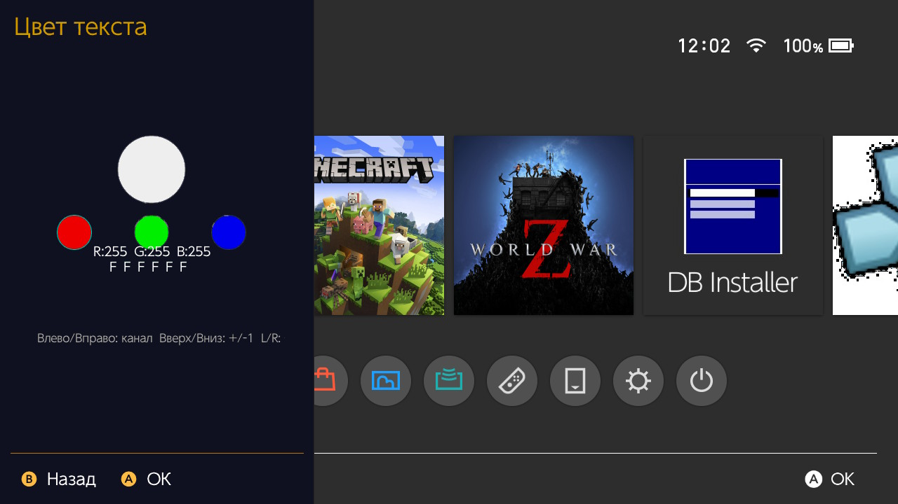

# Ryzhand Overlay — Release Notes

## Версия
- **Release.ini:** `latest_version=2.2.6`
- **Makefile (APP_VERSION):** `2.2.5`

> Примечание: сейчас в репозитории есть рассинхрон версий между `RELEASE.ini` и `Makefile`. Для релиза стоит привести к одному значению.

## Требования
- **HOS:** 16.0.0+
- **CFW:** Atmosphere
- **Loader:** `nx-ovlloader` (или `nx-ovlloader+`)

## Установка / Обновление
1. Установи `nx-ovlloader` / `nx-ovlloader+`.
2. Скопируй `ovlmenu.ovl` в:
   - `sd:/switch/.overlays/ovlmenu.ovl`
3. Перезапусти консоль (или перезапусти ovlloader, если у тебя так принято).
4. Открытие меню:
   - по хоткеям Ryzhand (по умолчанию `ZL+ZR+DDOWN`) либо по хоткеям Tesla (если они настроены).

## Что нового
- Улучшен выбор **цвета текста**:
  - добавлены “круги”/пресеты для быстрого подбора
  - стало удобнее подгонять цвета под тему и читаемость
- Добавлен эффект “**лестницы**” (staircase reveal) для списков.
  - можно **отключить** в настройках
- Добавлен **LED-индикатор** (уведомления) и переключатель **вкл/выкл** в настройках.
  - на **Switch Lite** пока **не работает**, поэтому сделан отдельный выключатель

## Screenshots

## Troubleshooting (если есть fatal / краш Tesla)
1. Уточни **когда именно падает**:
   - при открытии Tesla (`L+Down+RS`)
   - при запуске конкретного оверлея из меню
2. Забери лог:
   - `sd:/atmosphere/fatal_reports/*.log` (самый свежий)
3. В репорт добавь:
   - версии **HOS/AMS**
   - какой `nx-ovlloader` используешь
   - хоткеи и шаги воспроизведения

## Сборка (dev notes)
На Windows сборка большого `main.cpp` может упираться в память компилятора/линкера.

Рекомендации:
- **Отключить LTO** (`USE_LTO=0`) для локальной сборки, если видишь OOM.
- Если `cc1plus.exe: out of memory`:
  - убери `-g` из `CFLAGS` (debug symbols сильно раздувают потребление памяти)
  - временно отключи/убери `-flto=$(NPROC)` если он добавляется без условия.

## Известные ограничения
- Управление “LED на самой консоли Switch Lite” из userland-оверлея **может быть невозможно** без низкоуровневого доступа (gpio/i2c/pmic), что потенциально небезопасно.
- Notification LED (`hidsysSetNotificationLedPattern`) **не гарантирован** для `Embedded` устройства.
